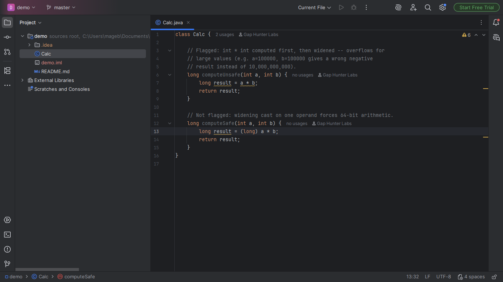
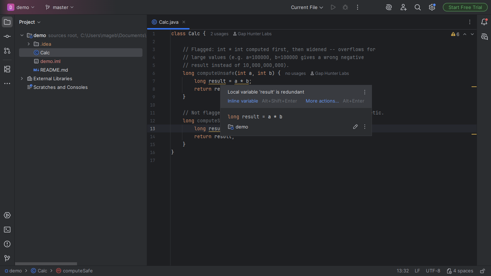
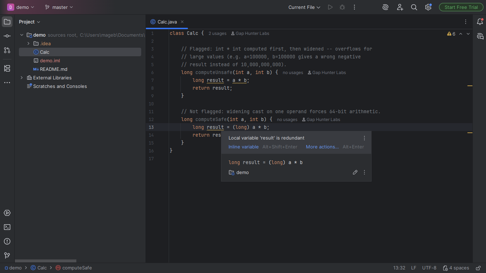

# Integer-Overflow-on-Widening Companion

Warning on an `int * int`/`int + int` expression assigned/passed
directly to a `long`-typed destination (a local variable's initializer,
an assignment, a method parameter, or a method return) with no
widening cast on either operand.

## Screenshots







## Why it exists

CWE-190 (Integer Overflow or Wraparound) -- the operation happens in
32-bit `int` arithmetic FIRST, silently truncating the result (often
to a negative value) before the already-wrong value is widened to
`long`. Integer overflow analysis for Java has few dedicated tooling
options in general; this narrow, syntactically unambiguous form has no
dedicated Marketplace plugin found.

## Why built this way

General integer-range overflow analysis is a research-level problem;
staying honest here means resisting the temptation to generalize and
publishing only the syntactically unambiguous form -- a direct
assignment to a wider type with no intermediate cast, checked in every
real destination shape (variable initializer, assignment, method
argument, method return).

## v0.1 scope — stated honestly, not exhaustively

Only the exact shape `int OP int` assigned directly to a `long`
destination -- never analyzes longer expression chains, and never
multiplication/addition of more than two operands.

## Usage

Open any Java file. An `int * int`/`int + int` expression assigned or
passed directly to a `long` destination shows a warning.

## Enterprise / Team Licensing

Need enterprise features, custom rules, or team licensing? Contact us at
**gaphunterlabs@gmail.com**.

## Development

```
./gradlew test           # unit tests
./gradlew buildPlugin    # generates build/distributions/*.zip
./gradlew verifyPlugin   # checks compatibility against real IDEs
```

## License

Apache-2.0. See `LICENSE`.
